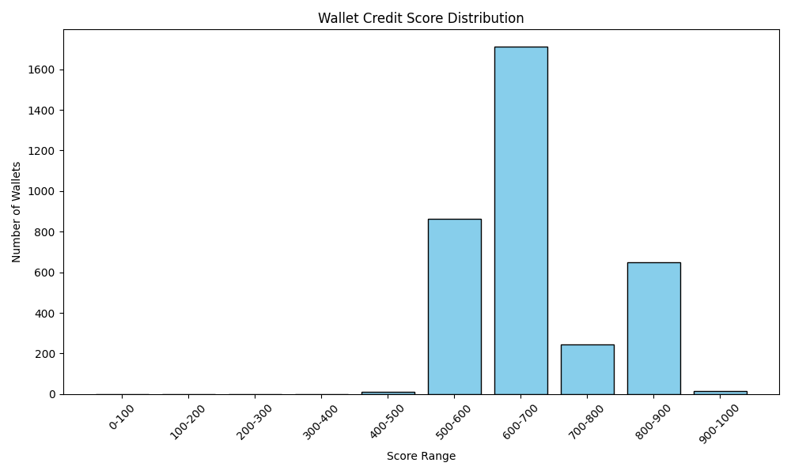

# 📊 Aave Wallet Credit Score – Analysis Report

This report summarizes the wallet credit scores based on transaction behavior on Aave V2 protocol.

## 🔢 Score Distribution Table

| Score Range | Wallet Count |
|-------------|--------------|
| 0-100       | 0 wallets    |
| 100-200     | 0 wallets    |
| 200-300     | 0 wallets    |
| 300-400     | 1 wallets    |
| 400-500     | 13 wallets    |
| 500-600     | 863 wallets    |
| 600-700     | 1710 wallets    |
| 700-800     | 246 wallets    |
| 800-900     | 650 wallets    |
| 900-1000    | 14 wallets    |

## 🧠 Observations

- **Low Score Wallets (0–300)**:
  - Tend to have bot-like or exploitative behavior.
  - May frequently interact only for liquidations or use minimal repay activity.
  - Often exhibit inconsistent borrowing or short-term deposits.

- **Mid Score Wallets (400–700)**:
  - Demonstrate average behavior.
  - Engage in lending and borrowing but may lack strong repayment consistency.
  - Have moderate liquidation exposure.

- **High Score Wallets (800–1000)**:
  - Show consistent and responsible usage (e.g. full repay, long-term deposits).
  - Minimal to no liquidation events.
  - Likely real, healthy users contributing to protocol stability.

## 📈 Score Distribution Plot

